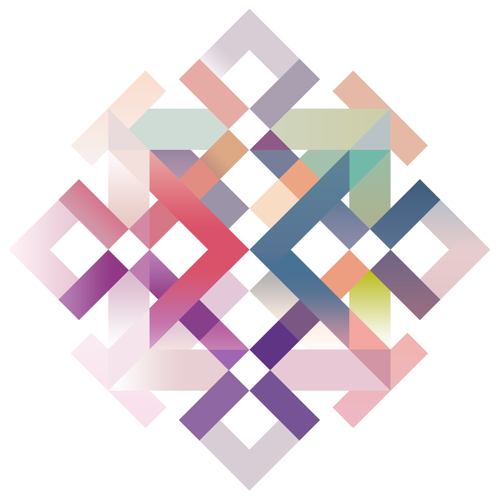

<p align="center">
  
</p>

# Kaleidoscope

[![CC BY-NC-SA 4.0][cc-by-nc-sa-shield]][cc-by-nc-sa]

> **This project is still in active development, but the core app is already usable.** Media management, taxonomy editing, prism tooling, continuous and ad hoc stream construction, and local playback-oriented scheduling are all implemented. Documentation is being updated alongside the codebase.

---

## What Is This?

Kaleidoscope is a personal television network simulator built on procedural selection algorithms. You point it at your media library, and it builds a continuous broadcast channel from what you already own. Shows start on the hour or half-hour. "Commercials" (or any short form media lasting between 10 seconds and 2 minutes), shorts, and music videos fill the gaps between them. Promos and bumpers give the channel its own identity. It runs all day, every day, and rolls over at midnight into the next day's schedule without any intervention.

None of this has to be running at full capacity. Anchors can play back-to-back without any buffer content between them, content can run in free sequence without being locked to the top or bottom of the hour, and the taxonomy-guided selection can be set aside entirely if you'd rather the stream just pull from your library without that kind of steering.

The short version is that it tries to recreate what it felt like to turn on the TV in the 90s and early 2000s and just watch whatever was on, except everything on the channel belongs to you. And it does it without manual curation.

---

## Current Feature Set

As of the current codebase, Kaleidoscope includes:

- **Library management for core media types** — movies, shows, shorts, music, commercials, promos, bumpers, and collections all have dedicated management flows in the app.
- **Taxonomy management** — genres, aesthetics, eras, specialties, holidays, age groups, and musical genres can be created and maintained in-app.
- **Prism tooling** — Facets and Mosaic management screens are implemented, including facet relationship editing and facet-to-musical-genre mapping.
- **Continuous and ad hoc streams** — both stream types support cadenced and uncadenced playback, as well as themed and random selection.
- **Procedural theme walking** — streams can transition using taxonomies, facet relationships, holiday logic, and age-group-aware filtering instead of pure random shuffle.
- **Collection-aware movie sequencing** — movie selections can continue through collections with scope-aware progression for continuous streams and programming blocks.
- **Scheduled programming block insertion** — the stream builder can now inject scheduled Curated Movie Marathon, Tag Themed, and Show Order block segments directly into the generated stream timeline.
- **SQLite-backed persistence** — core media, tags, collections, prisms, stream progressions, and collection progression state are persisted locally.

---

## The Problem It Solves

Most personal media libraries are massive, and that's the problem. Random playback feels arbitrary. Browsing leads to indecision. You end up watching the same handful of things because picking something new is friction you don't want to deal with at 9pm.

Broadcast TV in its heyday solved this problem by accident. There were only a few things on at any given time, so you watched what was there. Programming blocks gave the day structure and rhythm. The lack of infinite choice made the experience easier, not worse. Kaleidoscope is an attempt to bring that same dynamic into a world where you have everything but can never decide what to watch.

By handling selection and scheduling procedurally, Kaleidoscope removes the burden of deciding while still keeping the stream personal. It won't queue up something you'd hate. It uses your library, your tags, and your rules to build something that actually feels curated rather than shuffled.

---

## How It Works

Kaleidoscope builds its streams around a few core ideas.

**Anchor media and buffers.** The stream is assembled from media blocks, each containing a main piece of content (a movie or episode) and a buffer of shorter material that fills the time between it and the next anchor. The buffer is divided into two halves: one half thematically matched to the anchor that just played, and one half matched to the one coming up next. A short promo bridges them in the middle. The buffer is optional; if "cadenced" mode is turned off, the block contains just the anchor itself and the next one follows immediately. If you have no buffer media available to add to your stream, Kaleidoscope ships with generic liminal buffer media. Episodes for a show will always follow in sequence when they are procedurally selected and restart a series when it has completed and selected once again.

**Cadenced timing.** Feature-length content always starts at the top or bottom of the hour, just like on a real channel. If a movie ends at 9:47, the system calculates the gap to 10:00, selects exactly enough buffer content to fill it, and starts the next anchor at the hour. This is optional. Without it, anchors play in sequence with each one following the previous directly, without waiting for a clock boundary and no buffer is created.

**Thematic walking.** Rather than picking the next movie at random, Kaleidoscope tries to walk through your library in a way that keeps adjacent content from feeling jarring. A kids cartoon block doesn't slam into adult horror. A cyberpunk thriller doesn't immediately give way to a folk comedy. The transitions are guided by a taxonomy system that describes media across several overlapping dimensions.

**Programming blocks.** You can designate stretches of the day as programming blocks with their own rules: specific shows that always run in sequence, reserved slots for movies matching certain tags, themed interludes. Blocks can repeat daily, weekly, monthly, yearly, or run as one-offs. Episodes for shows that are selected for the block keep their seqeunce continuity strictly to the programming block, there is no cross contamination between the episode progression of the main stream and programming blocks.

**Continuous and ad hoc streams.** A continuous stream runs indefinitely, rolling over at midnight with a fresh schedule. An ad hoc stream has a defined endpoint and ignores the daily schedule entirely, useful for a themed evening or a single long session.

---

## The Taxonomy System

The taxonomy system is the part of this project I've spent the most time thinking about, and where a majority of my work for this project has been centered.

Standard genre labels are too blurry to be useful for thematic curation. "Science Fiction" covers everything from Arrival to Guardians of the Galaxy to Short Circuit, and those films have almost nothing in common as viewing experiences.

Kaleidoscope classifies media across six dimensions instead of relying on a single genre bucket:

- **Genres** cover the narrative backbone of the story, what kind of plot it tells at its core, stripped of surface presentation.
- **Aesthetics** cover how the story is dressed and styled, the visual and cultural identity of the work.
- **Age Groups** define the intended audience maturity level, which also carries a huge amount of tonal information, not just adult situations but how concepts are processed through the media.
- **Eras** describe the production period, which shapes storytelling conventions and tropes in ways that cut across genre and aesthetic.
- **Specialties** are user-defined groupings for franchises, creators, or any other thematic connection that matters to you.
- **Holidays** allow seasonal media to integrate naturally into a stream based on the calendar.

Musical genres for music and music videos get their own separate dimension because they operate differently from visual media.

The [full taxonomy documentation](docs/taxonomies/index.md) goes into much more depth on each of these, including why the definitions are drawn the way they are. I would recommend reading through this as there are things that might surprise you, one example as why I believe Star Wars is not Science Fiction, even though there are spaceships. The documentation proves why.

The inclusion of my specific definitions of different taxonomies in the documentation however are unimportant to the operation of the application. None of the taxonomies listed in my documentation are codified in any way into Kaleidoscope and should be considered a detailed guide on how to best utilize the system under conventional means. A user may create any taxonomy they wish based on their own idiom, whims and definitions. The taxonomies serve as examples and as optional default tags which are described below in the Proofs section.

---

## The Prism System

The Prism system is how Kaleidoscope actually uses the taxonomies to make decisions. Taxonomies describe media. Prisms decide what to do with those descriptions.

The core of it is called **Facets**: every combination of Genre and Aesthetic tags forms a facet, and the system maintains a distance matrix between facets so it knows which ones transition naturally into which others. When the stream needs to move from one anchor to the next, it looks at the source facet, consults the distance matrix, and selects a destination that feels adjacent rather than random. New facet relationships begin at a neutral midpoint and can then be refined by the user through the Facets management UI.

**Spectrum** handles the selection logic for buffer media, weighting candidates based on how close they are to the current thematic position of the stream.

**Mosaic** handles music. It maps facets to musical genres, so the music, music videos, and scored content that appear in a buffer can match the tone of the content around them. The Mosaic editor is now part of the current UI, including facet selection, musical genre assignment, and in-modal search/filtering for genre selection.

The [Prism documentation](docs/prisms/) is still being written, but the [Facets overview](docs/prisms/facets/index.md) covers some of these core concepts thoroughly.

---

## Taxonomy Proofs

One of the more unique pieces of documentation I have decided to include in this project is a growing library of proof files for individual movies and shows. Each proof is a written argument for why a specific piece of media deserves the taxonomy tags assigned to it, using the same definitions Kaleidoscope uses internally.

This serves two purposes: it keeps the tagging honest and consistent, and it creates a paper trail for decisions that might otherwise feel arbitrary. The proofs are in [docs/proofs/](docs/proofs/) if you want to see how the classification reasoning works in practice in order to add your own and use the taxonomy system effectively. This can be cross referenced with the description of the taxonomies found in the documentation located at [docs/taxonomies](docs/taxonomies/index.md)

These proofs also serve as explanations for the preset taxonomies Kaleidoscope will automatically add to certain pieces of popular media when they are added to it's media pool and are linked by their IMDB tag (Star Wars: A New Hope having the tag tt0076759 as an example, which can be seen as part of the URL https://www.imdb.com/title/tt0076759/). These taxonomies after they are automatically added can be adjusted or removed entirely.

It should be noted that these taxonomies are my own interpretation of the classification of genres and aesthetics and are not specifically codified in Kaleidoscope in any way other than the defaults that can be added with the IMDB link. If you disagree with any or all of my interpretations I encourage you to come up with your own classifications that will work within the system. Indeed there are many ways to classify taxonomies that exploit the system that I have created in unique and creative ways. Refer to the Backend Architecture documentation to learn how the Gate system works in selecting shows and movies if you wish to use the taxonomy system in unique ways outside of normal classification conventions.

---

## Backend Architecture

The backend runs entirely inside Electron's main process, organized into controllers, stream construction services, a runtime layer, and a SQLite persistence layer. If you want to understand how a user action turns into a media block in the player queue, or how the buffer construction engine calculates a commercial break, the [Backend Architecture document](docs/BackendArchitecture.md) covers every subsystem in detail.

---

## Tech Stack

- **Electron** for the desktop shell
- **React 19** and **TypeScript** for the UI
- **Material UI** for components
- **SQLite** via `better-sqlite3` for persistence
- **TanStack Query** for server state in the renderer
- **ffmpeg** and **VLC** for playback
- **Vite** for bundling

---

## Getting Started

```bash
npm install
```

For development, the React UI and Electron process run in parallel:

```bash
npm run dev
```

To build a distributable:

```bash
# Windows
npm run dist:win

# macOS
npm run dist:mac

# Linux
npm run dist:linux
```

Tests use Jest:

```bash
npm test
```

---

## What's Still Being Built

Kaleidoscope is functional but not finished. Here's what's actively in progress or coming up next.

**Remote streaming and broader playback targets.** Right now the channel is still fundamentally local-first. The next major step is pushing the constructed stream more cleanly into external targets such as Plex, Jellyfin, VLC, or other network-viewable outputs.

**Advanced programming block tooling.** Scheduled block execution is now in the backend, but block CRUD, fuller authoring workflows, richer schedule editing, and some of the more advanced edge policies still need to be finished in the app layer.

**MP3 support with visualizer.** Buffer media is still effectively video-first. Adding MP3 support would allow scored pieces, ambient tracks, and audio-only media to enter the buffer through a generated visual layer.

**Stream visualization UI.** There's still no great bird's-eye view of the upcoming channel. A proper timeline view for anchors, buffers, and scheduled programming blocks is still planned.

**Live tuning and curation polish.** Facets, Mosaic, and related prism tools are now in place, but there is still room for more runtime tuning controls, faster refinement workflows, and higher-level curation tools while the stream is already running.

---

## Documentation

The [docs folder](docs/) is the main reference for understanding how Kaleidoscope works.

- [Project Overview](docs/index.md)
- [Taxonomy System](docs/taxonomies/index.md)
- [Prism System](docs/prisms/)
- [Collections](docs/collections/index.md)
- [Programming Blocks](docs/programmingBlocks/index.md)
- [Backend Architecture](docs/BackendArchitecture.md)

---

## License

This work is licensed under a [Creative Commons Attribution-NonCommercial-ShareAlike 4.0 International License][cc-by-nc-sa].

[![CC BY-NC-SA 4.0][cc-by-nc-sa-image]][cc-by-nc-sa]

[cc-by-nc-sa]: http://creativecommons.org/licenses/by-nc-sa/4.0/
[cc-by-nc-sa-image]: https://licensebuttons.net/l/by-nc-sa/4.0/88x31.png
[cc-by-nc-sa-shield]: https://img.shields.io/badge/License-CC%20BY--NC--SA%204.0-lightgrey.svg

## Acknowledgements

Special thanks to all contributors and the open-source community for their support.
